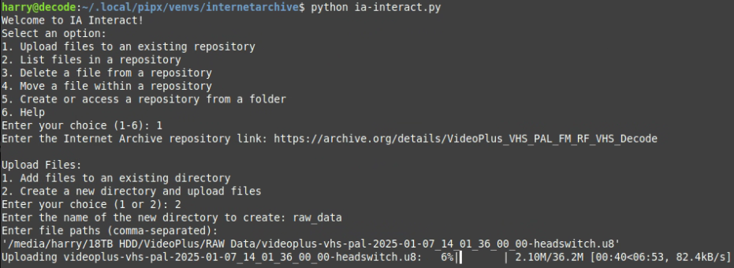

# Internet Archive Repository Management Script

An interactive command-line tool for managing Internet Archive repositories. 

Use this script to list files, upload files, delete files, move files, and create new repositories with detailed metadata input. 

Options include Test Mode (to simulate actions) and Permanent Mode (to execute changes).


## Simple and Effective




---

## Table of Contents

- [Internet Archive Repository Management Script](#internet-archive-repository-management-script)
  - [Simple and Effective](#simple-and-effective)
  - [Table of Contents](#table-of-contents)
  - [Features](#features)
  - [Prerequisites](#prerequisites)
  - [Installation](#installation)
    - [1. Preparing Your System](#1-preparing-your-system)
    - [2. Setting Up the Script](#2-setting-up-the-script)
    - [3. Installing Python Libraries](#3-installing-python-libraries)
    - [4. Configuring Environment Variables](#4-configuring-environment-variables)
  - [Usage](#usage)
    - [Running the Script](#running-the-script)
    - [Script Options](#script-options)
  - [Troubleshooting](#troubleshooting)
- [Full Breakdown and Feature Notes](#full-breakdown-and-feature-notes)
  - [Overview](#overview)
  - [Detailed Breakdown by Function](#detailed-breakdown-by-function)
    - [1. `get_repo_identifier(repo_link)`](#1-get_repo_identifierrepo_link)
    - [2. `upload_file_with_progress(identifier, file_path, directory)`](#2-upload_file_with_progressidentifier-file_path-directory)
    - [3. `list_repository_files(identifier)`](#3-list_repository_filesidentifier)
    - [4. `delete_file(identifier, file_path)`](#4-delete_fileidentifier-file_path)
    - [5. `move_file(identifier, file_name, source_dir, target_dir)`](#5-move_fileidentifier-file_name-source_dir-target_dir)
    - [6. `create_rules_file(folder_path)`](#6-create_rules_filefolder_path)
    - [7. `prompt_metadata()`](#7-prompt_metadata)
    - [8. `initialize_repository(folder_path, identifier, metadata, mode)`](#8-initialize_repositoryfolder_path-identifier-metadata-mode)
    - [9. `print_help()`](#9-print_help)
    - [10. `main()`](#10-main)
  - [Features List](#features-list)

---

## Features

- **Interactive Menu:** Choose options to list files, upload files, delete or move files, or create a new repository.
- **Test Mode & Permanent Mode:** Run in simulation (Test Mode, where no changes are made) or execute actual changes (Permanent Mode).
- **Metadata Support:** Input metadata including title, description, creator, date, language, license URL, collection, subject tags, and test item status.
- **Collection Options:** Supports collections such as `community`, `opensource`, `texts`, `movies`, `audio`, `image`, `etree`, `folksoundomy`, `games`, and `software`.
- **Progress Bars:** Uses `tqdm` to display file upload progress.
- **S3 Authentication:** Uses S3 access keys (set as environment variables) for secure communication with the Internet Archive.

---

## Prerequisites

Before you begin, ensure you have:
- A Linux environment (Ubuntu, Debian, etc.)
- Python 3 installed
- S3 Access Keys from [Internet Archive](https://archive.org/account/s3.php)
- An active internet connection

---

## Installation

### 1. Preparing Your System

**Update Your System:**

```bash
sudo apt update && sudo apt upgrade -y
```

**Install Python 3 and pip:**

```bash
sudo apt install -y python3 python3-pip
```

**Verify the Installation:**

```bash
python3 --version
pip3 --version
```

**(Optional) Install Git:**

```bash
sudo apt install -y git
```

---

### 2. Setting Up the Script

**Create a Working Directory:**

```bash
mkdir ~/internet_archive_tool && cd ~/internet_archive_tool
```

**Download the Script:**

- *Option 1: Clone from GitHub (if available):*

  ```bash
  git clone [REPOSITORY_URL] .
  ```

- *Option 2: Create the Script Manually:*

  Open your text editor and create a file named `internet_archive_tool.py`:

  ```bash
  nano internet_archive_tool.py
  ```

  Paste the full script code into the file, then save and exit.

**(Optional) Make the Script Executable:**

```bash
chmod +x internet_archive_tool.py
```

---

### 3. Installing Python Libraries

**Install Required Libraries:**

```bash
pip3 install requests tqdm
```

**Verify the Library Installation:**

```bash
pip3 show requests tqdm
```

---

### 4. Configuring Environment Variables

**Obtain Your S3 Access Keys:**

Retrieve your S3 keys from [Internet Archive](https://archive.org/account/s3.php).

**Set Up Environment Variables:**

Edit your shell configuration file (e.g., `~/.bashrc` or `~/.zshrc`) and add:

```bash
export S3_ACCESS_KEY="your-access-key"
export S3_SECRET_KEY="your-secret-key"
```

Replace `"your-access-key"` and `"your-secret-key"` with your actual keys.

**Reload the Configuration:**

```bash
source ~/.bashrc
```

**Test the Environment Variables:**

```bash
echo $S3_ACCESS_KEY
echo $S3_SECRET_KEY
```

---

## Usage

### Running the Script

To execute the script, run:

```bash
python3 internet_archive_tool.py
```

### Script Options

When the script runs, it displays an interactive menu with the following options:

- **List Files:** Display the contents of an existing repository.
- **Upload Files:** Add files to a repository.
- **Delete/Move Files:** Manage files within a repository.
- **Create a New Repository:** Upload an entire folder and configure repository metadata.

During repository creation, you will be prompted to:
- Input metadata (title, description, creator, date, language, license URL).
- Select a **collection** from the provided list.
- Enter **subject tags** (e.g., `music, history`).
- Specify if the repository is a **test item** (*Note: Test items are automatically deleted after 30 days*).
- Choose between **Test Mode** (simulate actions without an actual upload) and **Permanent Mode** (execute actual uploads).

---

## Troubleshooting

- **Missing Libraries:**  
  If you encounter errors about missing libraries, run:

  ```bash
  pip3 install requests tqdm
  ```

- **Environment Variables Not Set:**  
  Ensure your environment variables are defined in your shell configuration file and reload it:

  ```bash
  source ~/.bashrc
  ```

- **API or Network Issues:**  
  Verify that your S3 keys are correct and that your internet connection is stable.

- **Logging:**  
  To help with debugging, you can redirect output to a log file:

  ```bash
  python3 internet_archive_tool.py > script_output.log 2>&1
  ```


# Full Breakdown and Feature Notes


## Overview

"IA Interact" is an interactive command-line tool designed to manage repositories on the Internet Archive. It supports operations such as:

- **Uploading Files:** Upload individual files or entire folders to an Internet Archive repository.
- **Listing Repository Contents:** Retrieve and display the contents of a repository using the metadata API.
- **Deleting Files:** Remove specified files from a repository.
- **Moving Files:** Change a file’s location within a repository by copying it and then deleting the original.
- **Creating a New Repository:** Upload a folder as a new repository and submit metadata.
- **User Interaction:** Offers an interactive menu with a help option, test mode (simulation) vs. permanent mode, and filtering to avoid showing files from ".thumbs" directories.

This script uses the Internet Archive’s S3-compatible interface and Metadata API, and it includes robust file upload logic (with chunking, progress bars, and retry strategies).

---

## Detailed Breakdown by Function

### 1. `get_repo_identifier(repo_link)`
- **Purpose:**  
  Extracts the repository identifier from a full Internet Archive URL.
- **How It Works:**  
  Uses a regular expression to capture the pattern `/details/{identifier}`. If the URL is invalid, it alerts the user and returns `None`.

---

### 2. `upload_file_with_progress(identifier, file_path, directory)`
- **Purpose:**  
  Uploads a file to a specified directory within a repository.
- **Key Features:**
  - **Chunking:** Reads the file in 2MB chunks.
  - **Progress Tracking:** Uses the `tqdm` library to display a real-time progress bar.
  - **Retry Logic:** Implements retry strategy (5 retries) using an HTTPAdapter.
  - **S3 Authentication:** Reads S3 keys from environment variables and includes them in the request headers.
- **Note:**  
  The function sends HTTP PUT requests to the URL `https://s3.us.archive.org/{identifier}/{directory}/{filename}` to perform the upload.

---

### 3. `list_repository_files(identifier)`
- **Purpose:**  
  Retrieves and lists the files in a repository.
- **Key Features:**
  - **Metadata API:** Sends a GET request to `https://archive.org/metadata/{identifier}` to fetch repository metadata (in JSON).
  - **Filtering:** Excludes any files that reside in directories with names ending in ".thumbs" (i.e. if any component of the path ends with ".thumbs").
  - **Display:** Prints out a numbered list of the filtered file names.

---

### 4. `delete_file(identifier, file_path)`
- **Purpose:**  
  Deletes a file from the repository.
- **Key Features:**
  - **HTTP DELETE:** Sends a DELETE request to the S3 endpoint `https://s3.us.archive.org/{identifier}/{file_path}`.
  - **S3 Authentication:** Utilizes S3 credentials stored in environment variables.
  - **Feedback:** Notifies the user whether the file deletion succeeded (checks for HTTP 200 or 204).

---

### 5. `move_file(identifier, file_name, source_dir, target_dir)`
- **Purpose:**  
  Moves a file from one location in the repository to another.
- **Key Features:**
  - **Copy-Delete Approach:**  
    1. **Copy:** Uses an HTTP PUT request with the `x-amz-copy-source` header to copy the file to the target directory.
    2. **Delete:** If the copy is successful, deletes the original file.
  - **S3 Authentication:** Requires S3 keys from environment variables.
  - **Error Handling:** Provides error messages if the copy or delete fails.

---

### 6. `create_rules_file(folder_path)`
- **Purpose:**  
  Ensures that a local folder contains a `_rules.conf` file.
- **Key Features:**
  - **Default Rules:** If `_rules.conf` does not exist, it is created with the default content `CAT.ALL`.
  - **Usage:** This file can help control file visibility during repository uploads.

---

### 7. `prompt_metadata()`
- **Purpose:**  
  Collects metadata from the user required to create a new repository.
- **Collected Metadata Includes:**
  - **Basic Information:** Title, description, creator, date, language, license URL.
  - **Collection:** The user selects one from a predefined list (e.g., community, opensource, texts, movies, audio, image, etree, folksoundomy, games, software).
  - **Subject Tags:** A comma-separated list, such as "music, history".
  - **Test Item Flag:** A flag to indicate if the repository is a test item (if "yes" is entered, it sends "true"; if "no", the field is omitted).

---

### 8. `initialize_repository(folder_path, identifier, metadata, mode)`
- **Purpose:**  
  Uploads all files from a specified folder as a new repository.
- **Key Features:**
  - **Mode Selection:**  
    - **Test Mode:** Simulates the upload process without transferring any files.
    - **Permanent Mode:** Uploads each file via HTTP PUT requests.
  - **Recursive Upload:** Iterates through all files in the folder (using `os.walk`).
  - **Metadata Submission:** After file uploads, sends repository metadata via a POST request.

---

### 9. `print_help()`
- **Purpose:**  
  Displays a help message describing each menu option and its usage.
- **Features:**  
  Provides detailed instructions for each operation and references the official Internet Archive CLI documentation for further details.

---

### 10. `main()`
- **Purpose:**  
  Serves as the entry point of the script with an interactive menu.
- **Key Features:**
  - **Main Menu:** Displays options for uploading, listing, deleting, moving files, creating a repository, or viewing help.
  - **Conditional Prompts:**  
    - **For Existing Repositories (options 1–4):** Prompts for the repository URL after the option selection.
    - **For Folder-based Repository Creation (option 5):** Gathers folder path, mode, and metadata.
  - **Action Dispatch:** Calls the corresponding function based on the user’s selection.
  
---

## Features List

- **Interactive Command-Line Menu:**  
  Provides a user-friendly interface to access multiple repository operations.

- **Real HTTP Operations:**  
  All file operations (upload, list, delete, move) use actual HTTP requests in compliance with the Internet Archive’s API.

- **Chunked File Uploads with Progress Bar:**  
  Supports large file transfers by uploading in 2MB chunks and displaying progress using the `tqdm` library.

- **Robust Retry Strategy:**  
  Uses an HTTP adapter with exponential backoff to handle transient upload errors.

- **S3-Compatible Authentication:**  
  Reads S3 access keys from environment variables for secure communication with Internet Archive’s S3 endpoint.

- **Metadata Collection:**  
  Enables the creation of new repositories with detailed metadata, including collection selection and subject tags.

- **Test vs. Permanent Mode:**  
  Offers a simulation mode (Test Mode) for safe configuration verification along with full execution (Permanent Mode).

- **Directory Filtering:**  
  Automatically excludes files in directories with “.thumbs” from repository file listings.

- **Comprehensive Help:**  
  A built-in help option displays detailed usage instructions for all available operations.
